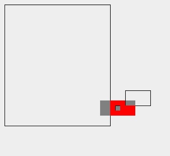

# occlusion

Given a rectangle and another list of rectangles which may occlude it, find the unoccluded region of the first rectangle.

The graphic output is a display of the original rectangle, as a solid grey box, the potentially occluding rectangles, as transparent grey boxes, and the unoccluded region in red.

